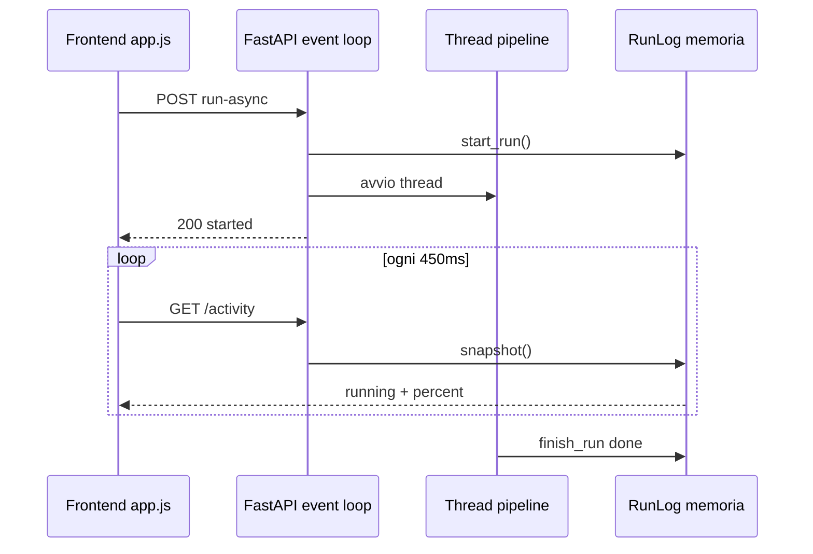
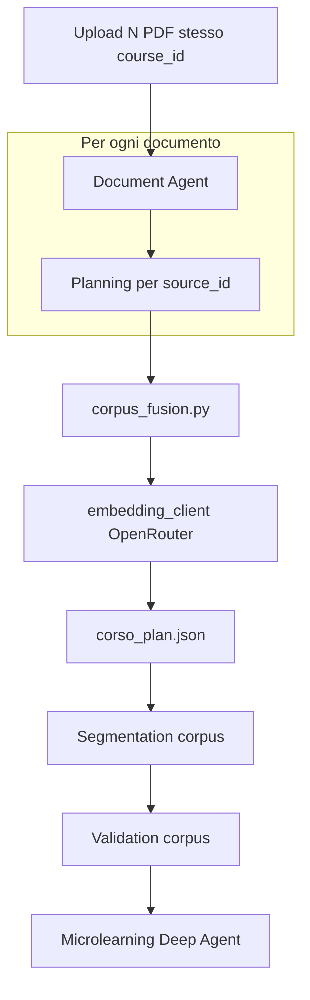
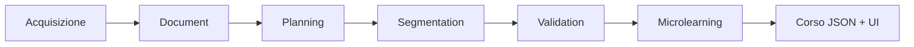
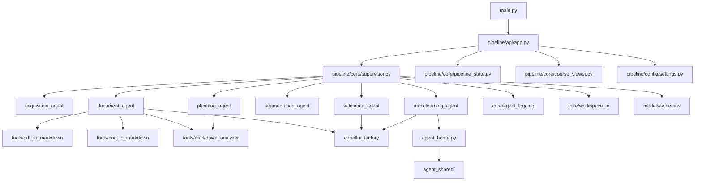

# Documentazione file del backend

Guida completa a **quali file servono**, **quali sono opzionali** e **cosa fa ogni file Python** nel backend della pipeline didattica multi-agente.

Per avvio rapido, API e configurazione `.env` vedi anche [README.md](README.md).

---

## Indice

1. [Panoramica](#panoramica)
2. [Cosa serve davvero vs cosa no](#cosa-serve-davvero-vs-cosa-no)
3. [Struttura cartelle (non-Python)](#struttura-cartelle-non-python)
4. [Riferimento completo file Python](#riferimento-completo-file-python)
5. [Flusso di collegamento tra i moduli](#flusso-di-collegamento-tra-i-moduli)
6. [Workspace di un corso](#workspace-di-un-corso)
7. [Cosa tenere in git](#cosa-tenere-in-git)
8. [Riassunto pratico](#riassunto-pratico)

---

## Panoramica

Il backend trasforma libri e documenti (PDF, Word, …) in **corsi microlearning** strutturati: lezioni in markdown, quiz interattivi, grafo del percorso e interfaccia web per avviare o riprendere la pipeline.

**Non tutti i file del backend sono codice applicativo.** Molti sono:

- dati generati a runtime (`workspace/`);
- esempi e materiale di test (`data/examples/`);
- script CLI comodi ma non obbligatori (`scripts/`);
- note e tool per il Deep Agent (`agent_shared/`).

I file Python del codice sono **35** in totale. Il resto del backend è soprattutto `static/`, `workspace/`, `data/` e file markdown di supporto.

---

## Cosa serve davvero vs cosa no

| Categoria | Cartelle / file | Necessario? |
|-----------|-----------------|-------------|
| **Codice applicativo** | `main.py`, `pipeline/` | **Sì** — senza questi non c’è server né pipeline |
| **Frontend** | `static/` (HTML, CSS, JS) | **Sì** — se usi l’interfaccia web |
| **Configurazione** | `.env`, `requirements.txt`, `.env.example` | **Sì** (`.env` è locale, non va in git) |
| **Libreria agente** | `agent_shared/` | **Sì** per lo step **Microlearning** (Deep Agent) |
| **Output runtime** | `workspace/*/` | **No come codice** — si crea e si aggiorna a ogni corso |
| **Esempi** | `data/examples/` | **No** — solo demo e test |
| **Script CLI** | `scripts/` | **No** — utili ma opzionali |
| **Duplicato** | `workspace/*/.agent/scripts/` | **No** — copie locali create dall’agente, non usate dal codice |

### In sintesi

| Obiettivo | File minimi |
|-----------|-------------|
| Avviare il server | `main.py` + `pipeline/` + `static/` + `.env` + dipendenze da `requirements.txt` |
| Pipeline completa fino al microlearning | tutto quanto sopra + `agent_shared/` |
| Sviluppo / test senza UI | `main.py` + `pipeline/` + `.env` (senza `static/` il server parte ma non c’è interfaccia) |

`workspace/` contiene i corsi già elaborati: puoi cancellare singole cartelle corso senza rompere il codice. `data/examples/` è materiale di riferimento statico.

---

## Struttura cartelle (non-Python)

```
progetto/backend/
├── main.py                     # Punto di ingresso
├── requirements.txt            # Dipendenze pip
├── .env.example                # Template variabili d'ambiente
├── .env                        # Config locale (NON committare)
├── README.md                   # Guida operativa (avvio, API, .env)
├── DOCUMENTAZIONE_FILE.md      # Questo file
│
├── pipeline/                   # Codice applicativo Python (vedi sezione dedicata)
├── scripts/                    # Wrapper CLI opzionali
├── static/                     # Frontend web
│   ├── index.html
│   ├── css/main.css
│   └── js/app.js
│
├── agent_shared/               # Libreria globale Deep Agent (note + script)
│   ├── notes/                  # Linee guida per l'agente microlearning
│   ├── scripts/                # Tool invocabili dall'agente
│   └── memory/                 # Memoria condivisa tra run
│
├── workspace/                  # Output runtime: una sottocartella = un corso
├── data/
│   ├── uploads/                # PDF/file di prova per upload manuale
│   └── examples/               # Workspace di esempio
│
└── temp/                       # Legacy: vecchi upload; ancora supportato
```

### `static/` — interfaccia web

| File | Ruolo |
|------|--------|
| `static/index.html` | Shell HTML: form upload, pipeline, log, risultati |
| `static/css/main.css` | Stili (tema scuro, quiz, grafo, explorer) |
| `static/js/app.js` | Logica client: polling activity, stato corso, grafo vis.js, quiz con punteggio in `localStorage` |

**Monitor live (`app.js`):**

- `startPolling()` interroga `/activity` ogni 450 ms; termina solo su `done` o `error`, non su `idle`.
- `loadActivitySnapshot()` al toggle del pannello Monitor: ricarica log storico e riprende polling se `running`.
- `renderActivityEntries()` aggiorna barra da `data.percent` o dall’ultima voce con percentuale.

### `agent_shared/` — supporto Deep Agent (non è codice del server)

| Percorso | Ruolo |
|----------|--------|
| `agent_shared/notes/` | Markdown con linee guida (struttura lezione, quiz, workflow, percorsi filesystem) |
| `agent_shared/scripts/` | Script Python che l’agente microlearning può eseguire sul corso corrente |
| `agent_shared/memory/` | Note di miglioramento persistenti tra le run |

---

## Riferimento completo file Python

### Punto di ingresso

#### `main.py`

Entry point dell’applicazione. Importa l’app FastAPI da `pipeline.api.app` e, se eseguito direttamente (`python main.py`), avvia **Uvicorn** su `0.0.0.0:8000` con reload attivo.

Alternativa equivalente:

```bash
uvicorn main:app --reload --host 0.0.0.0 --port 8000
```

---

### `pipeline/paths.py`

Definisce tutti i **percorsi radice** del backend:

| Costante | Percorso |
|----------|----------|
| `BACKEND_ROOT` | Root `progetto/backend/` |
| `WORKSPACE_ROOT` | `workspace/` |
| `AGENT_SHARED_ROOT` | `agent_shared/` |
| `STATIC_DIR` | `static/` |
| `DATA_DIR` | `data/` |
| `UPLOADS_DIR` | `data/uploads/` |
| `EXAMPLES_DIR` | `data/examples/` |
| `ENV_FILE` | `.env` |
| `LEGACY_TEMP_DIR` | `temp/` (retrocompatibilità) |
| `LEGACY_WORKSPACE` | `temp/workspace/` |

Espone anche `is_course_workspace_dir(name)` per distinguere le cartelle corso da cartelle infrastrutturali (es. `_agent_homes`).

---

### `pipeline/config/`

#### `pipeline/config/settings.py`

- Carica `.env` con `python-dotenv`.
- Maschera API key e segreti nel report di configurazione.
- Costruisce il payload per `GET /api/v1/config`: provider LLM effettivo, modello, parallelismo worker, variabili pipeline e logging.
- Integra `llm_factory` per verificare che il modello sia inizializzabile.

#### `pipeline/config/__init__.py`

Re-export di `get_config_report`.

---

### `pipeline/api/`

#### `pipeline/api/app.py`

Applicazione **FastAPI** completa:

- Monta `/static` se la cartella esiste.
- Serve `index.html` su `GET /`.
- Espone le API REST sotto `/api/v1/`:
  - `health`, `config`, elenco corsi, stato pipeline
  - log live (`activity`) per polling UI — run in memoria o fallback da `activity.log` con parsing percentuali
  - avvio pipeline sincrono e asincrono (`start_run` prima del thread; pipeline in **thread dedicato**)
  - ripresa da step intermedio
  - grafo e catalogo corso (`course-view`)
  - elenco e download file nel workspace
- Istanza globale `Supervisor` per tutta l’orchestrazione.

#### `pipeline/api/__init__.py`

Re-export di `app`.

---

### `pipeline/core/`

#### `pipeline/core/supervisor.py`

**Orchestratore centrale** della pipeline. Responsabilità principali:

- Crea e sanifica `course_id` e struttura cartelle del workspace.
- Chiama gli agenti in sequenza: acquisizione → document → planning → segmentation → validation → microlearning.
- Metodi principali:
  - `acquisisci_ed_elabora()` — nuovo corso con upload file
  - `resume_pipeline()` — ripresa da uno step
  - `list_courses()` — elenco corsi in `workspace/`
  - `get_course_status()` — stato step completati
  - `esegui_pipeline()` — batch job da JSON
- Supporta workspace legacy in `temp/workspace/` (corso `temp_workspace`).

#### `pipeline/core/pipeline_state.py`

Rilevamento **stato pipeline** per corso:

- Definisce `PIPELINE_STEPS` e `STEP_ORDER` (6 step + `done`).
- `analyze_course_workspace()` — ispeziona i file nel workspace e determina step completati, prossimo step, warning.
- Modelli Pydantic: `StepStatus`, `CoursePipelineStatus`, `PipelineWarnings`, `ModuleWarningSample`.
- Aggrega avvisi da report validazione e qualità documento.

#### `pipeline/core/agent_logging.py`

Sistema di **log narrativi** per pipeline e UI:

- Messaggi in italiano comprensibili all’utente finale.
- Percentuale di avanzamento per fase (pesi da 0% a 100%).
- `RunLog` in memoria per polling via `GET .../activity`.
- Scrittura persistente su `workspace/{course_id}/activity.log`.
- Supporto logging Deep Agent (tool call, risposte LLM, costi stimati).
- `setup_logging()` rispetta `LOG_LEVEL` e `LOG_VERBOSE`.
- **`start_run()` idempotente**: se esiste già una run `running` per lo stesso corso, non resetta il log.

#### `pipeline/core/embedding_client.py`

Client embedding **OpenRouter** (`https://openrouter.ai/api/v1`, endpoint `/embeddings`):

| Funzione / classe | Ruolo |
|-------------------|--------|
| `resolve_embedding_model()` | Modello da `OPENROUTER_EMBEDDING_MODEL` (default `openai/text-embedding-3-small`) |
| `embedding_batch_size()` | Dimensione batch da `CORPUS_EMBEDDING_BATCH_SIZE` (default 48) |
| `EmbeddingCache` | Persistenza vettori in `corpus_embeddings_cache.json` (chiave = hash SHA-256 del testo) |
| `embed_texts()` | Calcola vettori per lista di snippet; riusa cache, salva a fine run |
| `cosine_similarity()` | Similarità coseno tra due vettori (usata in fusione) |

Richiede `OPENROUTER_API_KEY` indipendentemente dal provider chat (Groq/OpenRouter).

#### `pipeline/agents/corpus_fusion.py`

Dopo il planning per-documento, **fonde** i `punti_taglio` in un piano corpus:

1. Per ogni punto di ogni libro, legge uno snippet dal markdown (`CORPUS_EMBEDDING_SNIPPET_CHARS`, default 1000).
2. Calcola embedding via `embed_texts()` (con cache).
3. Per ogni punto del documento «ancora» (tipicamente il primo libro), cerca nel secondo il candidato con similarità coseno massima.
4. Se `sim ≥ CORPUS_EMBEDDING_MIN_SIMILARITY` (default 0.28), crea un `PuntoTaglio` **integrato** con segmenti da entrambe le fonti e titolo `Integrazione: …`.
5. I punti non accoppiati restano come lezioni singolo-libro.

Output: `reports/corso_plan.json` con `livello_struttura: corpus`.

#### `pipeline/core/llm_factory.py`

**Factory LLM** con LangChain:

- Provider: `openrouter` (default) o `groq` (inferito dalle API key se `LLM_PROVIDER` non è impostato).
- `create_chat_model()` → `(llm, model_name, provider)`.
- Rate limiter in-memory per Groq (`GROQ_REQUESTS_PER_SECOND`).
- `resolve_llm_max_workers()` — parallelismo per analisi LLM nel Document Agent (`max` su OpenRouter, default 12 su Groq).

#### `pipeline/core/workspace_io.py`

Utility **I/O condivise**:

- `load_json()` / `save_json()` — lettura/scrittura JSON nel workspace.
- `read_lines()` — lettura file testo come lista di righe.
- `heading_level()` — livello heading markdown (`#`, `##`, …).
- `find_section_lines()` — trova intervallo righe di una sezione per titolo o query.

#### `pipeline/core/course_viewer.py`

Costruisce il payload per l’**UI grafo corso**:

- Legge `reports/microlearning_course.json`.
- Genera nodi (lezioni e quiz), archi (prerequisiti), catalogo markdown.
- Risolve riferimenti prerequisito per id, etichetta o pattern `pt_N`.

#### `pipeline/core/__init__.py`

Re-export di logging e pipeline state.

---

### `pipeline/models/`

#### `pipeline/models/schemas.py`

**Contratti dati Pydantic** per tutta la pipeline (~270 righe). Gruppi principali:

| Gruppo | Modelli |
|--------|---------|
| Input | `SourceInput`, `SourceConfig`, `JobBatchInput`, `ImportContext` |
| Document | `SourceProfile`, `QualityReport`, `QualitySignals`, `Issue`, `Chunk`, `DocumentHierarchy` |
| Planning | `StructuralPlan`, `PuntoTaglio` |
| Segmentation | `ModuloGrezzo`, `SegmentationOutput` |
| Validation | `ModuleValidation`, `ValidationReport` |
| Microlearning | `MicrolearningCourse`, `ModuloMicrolearning`, `DomandaQuiz`, `FonteRiferimento` |
| Pipeline | `AcquisitionRecord`, `PipelineSourceResult`, `FullPipelineOutput`, `JobBatchOutput` |
| Stati | `DocumentStatus` (enum: `PASS`, `PASS_WITH_WARNINGS`, `FAIL`) |

#### `pipeline/models/__init__.py`

Docstring del package; i modelli si importano da `schemas` direttamente.

---

### `pipeline/agents/` — un agente per step

| File | Step pipeline | Cosa fa |
|------|---------------|---------|
| `acquisition_agent.py` | **Acquisizione** | Riceve il file caricato dall’utente, lo salva in `uploads/`, rileva MIME type e se serve OCR, crea `AcquisitionRecord` e `SourceInput`. |
| `document_agent.py` | **Document** | Il modulo più grande (~900 righe). Converte PDF/Word/altro in Markdown (routing verso `pdf_to_markdown`, `doc_to_markdown` o `markitdown`), pulisce il testo, crea chunk testuali, analizza qualità con LLM in parallelo, produce gerarchia documento e report qualità in `reports/`. |
| `planning_agent.py` | **Planning** | Analizza struttura markdown; per ogni documento produce `reports/{id}_plan.json`. Con più fonti esegue **`planning_corpus`** e delega a `corpus_fusion.py` → `reports/corso_plan.json`. |
| `segmentation_agent.py` | **Segmentation** | Esegue i tagli fisici sul markdown secondo il piano strutturale → produce moduli grezzi in `modules/{source_id}_raw_modules.json` (corpus: `corso_raw_modules.json`). |
| `validation_agent.py` | **Validation** | Controlla coerenza logica, propedeuticità e prerequisiti. Regole locali + LLM opzionale (`VALIDATION_USE_LLM`: `off` / `flagged` / `all`) → `modules/{source_id}_validated_modules.json` e report validazione. |
| `microlearning_agent.py` | **Microlearning** | Usa **LangChain Deep Agents** (`create_deep_agent`): esplora il workspace del corso, consulta note in `agent_shared/`, scrive lezioni in italiano e quiz → `reports/microlearning_course.json`. |
| `corpus_fusion.py` | *(supporto planning)* | Embedding + similarità coseno per fondere `punti_taglio` multi-libro nel piano corpus. |
| `agent_home.py` | *(supporto microlearning)* | Monta il **filesystem virtuale** dell’agente: `agent_shared/` in scrittura (home globale), cartelle del corso corrente montate in sola lettura su route `/sources`, `/chunks`, `/reports`, `/modules`, `/uploads`. |

#### `pipeline/agents/__init__.py`

Vuoto — il package esiste per import modulari e test con `python -m pipeline.agents.<nome>`.

---

### `pipeline/tools/` — conversione e analisi testo

| File | Cosa fa | Usato da |
|------|---------|----------|
| `pdf_to_markdown.py` | Converte PDF → Markdown con **pymupdf4llm** (estrazione layout-aware). Supporta batch su cartelle, pulizia heading, CLI con `main()`. | `document_agent`, `scripts/convert_pdf.py` |
| `doc_to_markdown.py` | Converte `.docx` tramite **mammoth** e `.doc` tramite **pandoc** / LibreOffice. CLI con `main()`. | `document_agent`, `scripts/convert_doc.py` |
| `markdown_analyzer.py` | Analisi strutturale e statistica markdown: strip sintassi, conteggio parole, frequenze (con stop words IT/EN), mappa heading, profilo documento. | `planning_agent`, `document_agent` |

#### `pipeline/tools/__init__.py`

Vuoto.

---

### `pipeline/__init__.py`

Vuoto — rende `pipeline` un package Python importabile.

---

### `scripts/` — wrapper CLI (opzionali)

| File | Cosa fa |
|------|---------|
| `convert_pdf.py` | Aggiunge la root backend a `sys.path` e chiama `pipeline.tools.pdf_to_markdown.main()`. Uso: `python scripts/convert_pdf.py -i cartella -o output_md` |
| `convert_doc.py` | Idem per Word → Markdown via `pipeline.tools.doc_to_markdown.main()`. |
| `run_server.sh` | Script bash: `cd` nella root backend, attiva `.venv`/`venv`, esegue `python main.py`. |

La logica reale sta sempre in `pipeline/tools/`; gli script sono solo entry point comodi da terminale.

---

### `agent_shared/scripts/` — tool per il Deep Agent

Questi script **non fanno parte del server web**. L’agente microlearning li invoca quando esplora il corso corrente. Usano la variabile d’ambiente `WORKSPACE_ROOT` (impostata a ogni run sul percorso del corso).

| File | Cosa fa |
|------|---------|
| `list_sources.py` | Elenca i file in `WORKSPACE_ROOT/sources/` con dimensione in byte. |
| `list_reports.py` | Elenca i file `.json` in `WORKSPACE_ROOT/reports/`. |
| `grep_sources.py` | Cerca un pattern regex (case-insensitive) nei `.md` di `sources/`. Uso: `grep_sources.py <pattern> [sottostringa_nome_file]`. Max 30 hit. |
| `estrai_titoli_h2.py` | Stampa le prime 40 righe `##` del markdown principale in `sources/` (outline rapido per l’agente). |

---

### File Python che non servono al codice

| File | Nota |
|------|------|
| `workspace/{corso}/.agent/scripts/list_sources.py` | Copia locale creata da una run precedente del Deep Agent. Quasi identica a `agent_shared/scripts/list_sources.py`. **Eliminabile** senza impatto sul codice. |
| `workspace/{corso}/gen_all.py`, `create_lessons.py`, … | Script **scritti dall’agente** nella root del corso per accelerare la generazione batch. **Non fanno parte della pipeline**; spesso usano path assoluti o bypassano i tool ufficiali. Valutare se tenerli solo come debug. |

---

## Monitor live — sequenza UI ↔ backend

La pipeline **non** gira nell'event loop FastAPI: `_start_pipeline_thread()` la avvia in un `threading.Thread` daemon. Il polling `/activity` e le altre API restano disponibili per più client/tab.



---

## Corsi multi-documento — flusso corpus



| Artefatto corpus | Percorso |
|------------------|----------|
| Piano unificato | `reports/corso_plan.json` |
| Cache embedding | `reports/corpus_embeddings_cache.json` |
| Moduli grezzi/validati | `modules/corso_raw_modules.json`, `corso_validated_modules.json` |
| Metadati corso | `course.json` → `sources[]` elenco documenti |

---

## Flusso di collegamento tra i moduli

### Sequenza pipeline



| Step | Agente | Artefatti principali |
|------|--------|----------------------|
| acquisition | `AcquisitionAgent` | `uploads/`, metadati acquisizione |
| document | `DocumentAgent` | Markdown in `sources/`, chunk, report qualità, gerarchia |
| planning | `PlanningAgent` | `reports/{id}_plan.json` |
| segmentation | `SegmentationAgent` | `modules/{id}_raw_modules.json` |
| validation | `ValidationAgent` | `modules/{id}_validated_modules.json`, report validazione |
| microlearning | `MicrolearningPlanningAgent` | `reports/microlearning_course.json` |

### Architettura moduli



---

## Workspace di un corso

Ogni corso vive in `workspace/{course_id}/`. Esempio: `workspace/think_python/`

```
think_python/
├── course.json              # Metadati corso (id, source_id, file originale)
├── activity.log             # Log narrativo persistente
├── uploads/                 # File caricato + JSON acquisizione
├── sources/                 # Markdown (raw, clean, finale)
├── chunks/                  # Chunk testuali per LLM
├── reports/                 # Piano, qualità, gerarchia, validazione, microlearning
└── modules/                 # Moduli grezzi e validati
```

### File chiave per step

| Step completato se esiste… | File tipico |
|----------------------------|-------------|
| Acquisizione | `uploads/{source_id}_acquisition.json` |
| Document | `sources/{source_id}_clean.md`, `reports/{source_id}_quality.json` |
| Planning | `reports/{source_id}_plan.json` |
| Segmentation | `modules/{source_id}_raw_modules.json` |
| Validation | `modules/{source_id}_validated_modules.json` |
| Microlearning | `reports/microlearning_course.json` |

Il file finale usato dall’UI (grafo, quiz, catalogo) è **`reports/microlearning_course.json`**, letto da `course_viewer.py`.

---

## Cosa tenere in git

### Da committare

- Tutto `pipeline/` (codice)
- `main.py`, `requirements.txt`, `.env.example`
- `static/` (frontend)
- `agent_shared/` (note e script agente)
- `scripts/` (CLI)
- `README.md`, `DOCUMENTAZIONE_FILE.md`
- `data/examples/` (se servono come riferimento al team)

### Da escludere (già in `.gitignore` o consigliato)

| Pattern | Motivo |
|---------|--------|
| `.env` | Contiene API key |
| `.venv/`, `vevn/` | Virtual environment locale |
| `__pycache__/`, `*.pyc` | Bytecode Python |
| `workspace/` | Output runtime, rigenerabile |
| `temp/` | Upload legacy |

Suggerimento: aggiungere esplicitamente `progetto/backend/workspace/` al `.gitignore` se i corsi generati finiscono nel repository per errore.

---

## Riassunto pratico

| Domanda | Risposta |
|---------|----------|
| Quanti file `.py` ci sono? | **35** (34 utili + eventuali copie in `workspace/.agent/`) |
| Cosa è indispensabile? | `main.py`, `pipeline/`, `static/`, `agent_shared/`, `.env` |
| Cosa posso cancellare? | Contenuto di `workspace/`, `data/examples/`, duplicati `.agent/` nei corsi |
| Dove sta la logica di business? | `pipeline/agents/` + orchestrazione in `pipeline/core/supervisor.py` |
| Dove sta l’API HTTP? | `pipeline/api/app.py` |
| Dove sono i contratti dati? | `pipeline/models/schemas.py` |
| Come testo un singolo agente? | `PYTHONPATH=. python -m pipeline.agents.document_agent` (dalla root backend, venv attivo) |

---

*Ultimo aggiornamento: giugno 2026 — corpus multi-libro, monitor live, embedding OpenRouter.*
